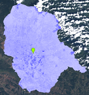

# TP3-IDV
- Universidad de Costa Rica 
- GF-0618 FOTOGRAMETRÍA Y TELEDETECCIÓN
- MSc.María José Molina Montero
- Estudiante Steven Guillén-Ana López  
# Objetivo 
El propósito de esta práctica de laboratorio es brindarle un recorrido por los índices espectrales que se pueden utilizar para mejorar los fenómenos de interés en imágenes de detección remota. Se le presentarán métodos para crear índices de vegetación, agua, nieve, áreas desnudas y quemadas.

## Procedimiento
- Seleccione un área de estudio para implementar todos los índices (trabajar región
Chorotega,para obtener más imágenes libre de nubes).
> Cuenca Bebedero:  
> Esta cuenca tiene un área de 2.067,22 km2 lo que representa un 4.04% de la
superficie nacional. 
- Escoja una cuenca hidrográfica, realice el corte para adaptar todas.

### NDVI

En las zonas de la cuenca donde se ve un tono verde más oscuro, el valor del NDVI puede llegar hasta 0.80, reforzando con ello la presencia de áreas con un crecimiento constante y alta densidad de vegetación. En las zonas urbanas como Cañas encontramos un índice muy bajo de 0.19. Como es de esperar, los cuerpos de agua presentan valores negativos.Las zonas con escasa vegetación y suelo desnudo presentan valores bajos y moderados entre 0.2 y 0.5.
El índice de Vegetación de Diferencia Normalizada es un indicador de la biomasa fotosintética activa, es por ello que se utiliza para identificar la salud de la vegetación. Se puede distinguir la cobertura terrestre con énfasis en las zonas con mayor vegetación. Con base en el nivel de reflectancia se puede incluso categorizar el tipo de vegetación que se observa. De igual manera, debido a sus propiedades es de gran utilidad para dar seguimiento a procesos de desertización e incluso para el monitoreo de cultivos y su evolución.

>*Desde el análisis que realizan Hassan et al. (2019) el NDVI se considera como el índice de vegetación de teledetección más utilizado y consistente a nivel mundial, destacando la simpleza de su fórmula pues se requiere solamente implementar la proporción de energía reflejada en el espectro de reflectancia infrarrojo cercano (NIR) y proporción roja del espectro de luz (RED) (p.96).*

Se emplea la fórmula NDVI con álgebra de bandas = (NIR-RED) / NIR+RED). La escala de medición va de -1.0 a 1.0, los valores negativos representan superficies sin vegetación.
Al realizar el análisis se debe tener en cuenta que el pigmento de clorofila en una planta sana absorbe gran cantidad de luz roja visible, la estructura celular de la planta refleja un mayor porcentaje de la luz del infrarrojo cercano. Las zonas de vegetación con bosque denso tienen una mayor reflectancia del infrarrojo cercano y por lo tanto valores más altos del índice con vegetación saludable. 
### EVI 

>*Con base en Borja (2020) EVI presenta una sensibilidad mayor al índice NDVI cuando se visualizan regiones de alta biomasa, además destaca su aporte en la reducción de la influencia de condiciones atmosféricas y citando a (Didan et al., 2015) destaca que el índice realiza un desacoplamiento respecto a la señal del fondo del dosel que proporciona un mejor monitoreo de la vegetación (p.10).*

Se observa una imagen más texturizada, sensible a los detalles y con más contraste en comparación con el NDVI, esto se debe a que este índice reduce la influencia de condiciones atmosféricas posibilitando  un mejor análisis. 
Para la estación seca se escogió el periodo de enero a marzo, en este caso se presentan valores de píxel con mejor detalle pues la nubosidad no tiene influencia. 

Para la estación lluviosa se escogió el mes de octubre ya que según Mena (2019) la máxima precipitación en esta región se presenta en este mes, por lo tanto, tal como se aprecia en la imagen, surge una mayor nubosidad que influye en la lectura de los valores. Sin embargo, en las zonas sin nubes y donde hay más absorción se puede observar que el EVI es mucho más alto que en la estación seca.

> *Permite generar aplicaciones donde “la radiación absorbida proporciona información en conjunto sobre diferentes atributos de la vegetación, como el contenido de clorofila de la hoja, la fracción de la cubierta vegetal, el área de la hoja o la estructura del dosel forestal” (Glenn et al. 2008 citado por Muñoz y Burdett, 2019).*

Con respecto a la cuenca Bebedero EVI es de gran utilidad pues permite identificar áreas que conforman la cuenca con suelo desnudo y escasa vegetación, en contraste con las Áreas Protegidas caracterizadas de vegetación densa como las zonas cercanas a los volcanes Tenorio y Miravalle o el Parque Nacional Palo Verde.

## NDWI
El Normalized Difference Water Index (NDWI) es un índice direccionado a identificar el agua y nivel de humedad en la vegetación y suelos. Fundamental para corroborar el estrés hídrico que sufre un área determinada.
>*En índices vegetativos -1 a +1, estando los valores menores a 0 asociados a superficies brillantes, sin presencia de vegetación o agua y los mayores a 0 asociados a presencia de agua y vegetación (Segura, 2020, p.48-49).*
Utiliza NIR: Banda infrarroja cercano junta a SWIR: Banda infrarroja de onda corta. Las bandas 8 y 11 en Landsat.
    En la cuenca se logran diferenciar zonas con agua y zonas de tierra seca, debido a la particularidad de la cuenca Bebedero este es uno de los índices en el cual mejor se aprecian los contrastes ya que posee una red hídrica muy amplia que desemboca en el río Tempisque y posteriormente en el estuario del Golfo de Nicoya. Los cuerpos de agua tienen una radiación baja y una fuerte absorción en el rango de longitudes de onda del infrarrojo visible.

> El trabajo desarrollado por Segura (2020) es un claro ejemplo de la utilidad de NDWI pues se presenta esa interacción con la unidad de suelo y el índice NDVI direccionando los esfuerzos para conocer el estrés hídrico que sufre el cultivo de caña de azúcar en la cuenca de Bebedero y Tempisque. La mayor cantidad de agua disponibles es utilizada para el riego de cultivos por ello resulta sumamente importante el monitoreo de estos cuerpos de agua.

### NDWBI
Continuando con el análsis de los cuerpos de agua, este índice según lo espuesto por McFEETERS (1996) 
>*El NDWI hace uso de la radiación infrarroja cercana reflejada y la luz verde visible para mejorar la presencia de tales características al tiempo que elimina la presencia de características de la vegetación terrestre y del suelo.*

Al realizar la comparación con el NDWI se puede entender que la banda de luz verde utilizada en el álgebra de bandas genera que las zonas con vegetación no tengan reflectancia y se puede apreciar aún con mayor facilidad el caudal de los ríos y las lagunas presentes en la cuenca.

### NDBI
El NDBI o Índice de Diferencia Normalizada Edificada identifica las zonas urbanas, por la particularidad de la cuenca Bebedero se presentan ciudades importantes como Cañas, Nicoya o Tilaran que generan una reflectancia caracterizada por tonalidades grises. Diferenciándose de la gran cobertura de vegetación y suelos de cultivo presentes en la región.
> Tal como se expone en la página web Gis and Beers () Al igual que en índices análogos (como el NDWI o el NDVI) el intervalo de valores resultantes oscila entre -1 y 1, donde aquellos valores de tendencia negativa indican presencia de zonas con vegetación. Valores intermedios comienzan a determinar zonas desnudas, cultivos en crecimiento o zonas o en fase de construcción a medida que adquieren valores de tendencia positivos elevados para indicar zonas territoriales con coberturas de suelo edificadas o infraestructuras antrópicas.

### BAI 
Un índice que llama la atención pues permite apreciar la evolución de un incendio forestal y el impacto que tiene en la cobertura terreste.
> 
>* El índice BAI es diseñado específicamente para la cartografía de las áreas quemadas, por lo que es un índice competente para la discriminación de las misma. Se basa en el concepto de distancia eucliadiana de cada uno de los píxeles de la imagen a un punto de la convergencia definido en un espacio biodimensional. Por lo tanto, resalta la tierra quemada desde el intervalo de longitudes de onda del rojo (R) al infrarrojo cercano (NIR), con el motivo de enfatizar la señal de quemado en imágenes posteriores al incendio.*(Bazán, 2021,p.11)
